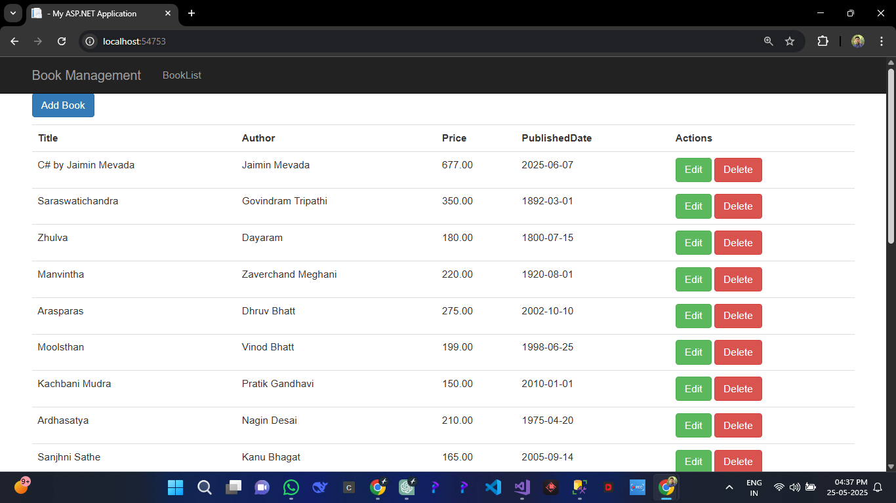
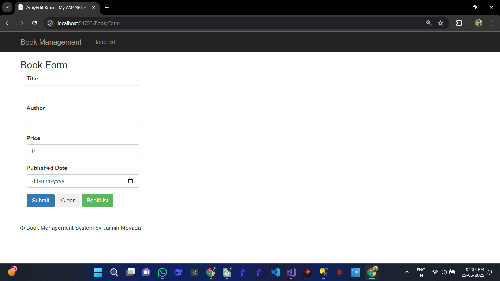
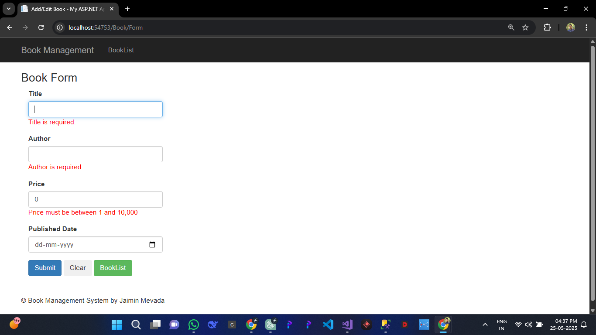
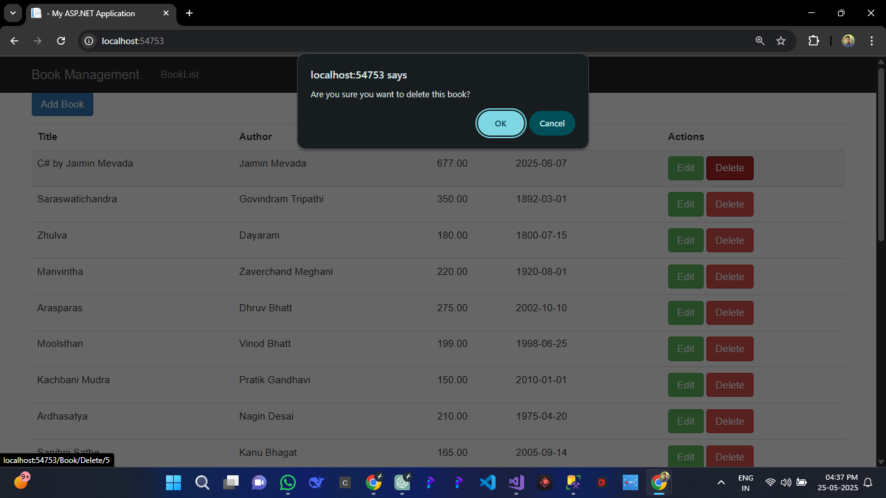

## 📝 Quick Notes

- Added Context folder for separated entity model using `.edmx`
- Checked that blank data is not accepted
- Validation added using Data Annotations
- Add and Edit use the same form for reusability
- Success messages handled via `TempData`
- Clean, responsive UI using Bootstrap
  
---
## 📁 Folder Structure

**Context**      ---> This folder contains the EDMX Entity Framework file  
**Controllers**  ---> BookController  

**Views**         --->     1. BookList View (It shows list of exisitng books)
                  --->    2.Form View (It contains the form for Edit and Add Book)  

---

## 🛠️ Technologies Used

- **ASP.NET MVC 5**
- **Entity Framework (Database First)**
- **C#**
- **Bootstrap (CSS Framework)**
- **Razor View Engine**
- **SQL Server**

## 📸 Project Screenshots

### 🏠 Book List Page

### ➕ Add Book Form

### ✏️ Validation Message in Form

### ❌ Delete Confirmation

